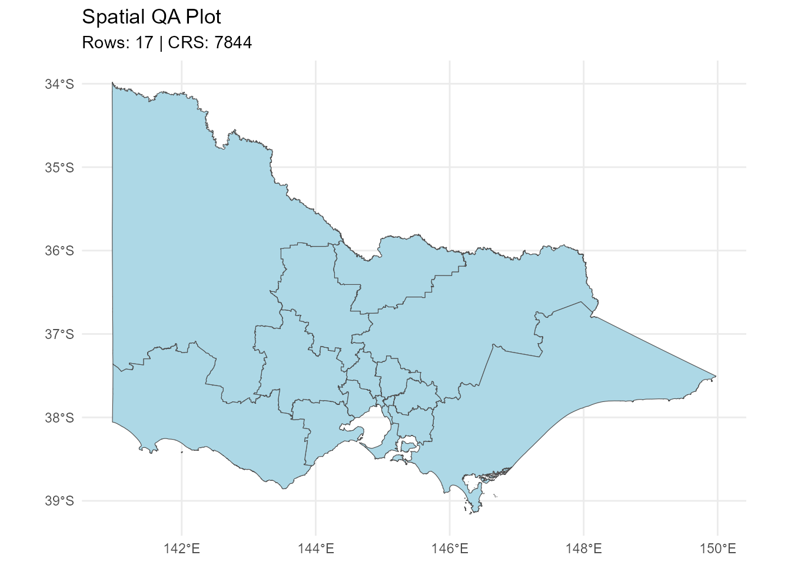

# Getting Started with etlspatial

``` r

library(etlspatial)
library(sf)
#> Linking to GEOS 3.13.1, GDAL 3.11.4, PROJ 9.7.0; sf_use_s2() is TRUE
library(DBI)
library(duckdb)
#> Warning: package 'duckdb' was built under R version 4.5.3
```

`etlspatial` is a lightweight spatial ETL framework for building
reproducible, production-ready geospatial workflows in R.

It provides a consistent interface for reading, standardising, and
writing spatial data across ESRI formats (file geodatabases and
shapefiles) and open formats such as GeoPackage, with integrated DuckDB
support for scalable analytics.

The package is designed to be engine-agnostic, portable, and robust to
changes in data source environments.

## Spatial Format Support

`etlspatial` supports both ESRI-native and open spatial formats:

- ESRI File Geodatabases (`.gdb`)
- ESRI Shapefiles (`.shp`)
- GeoPackage (`.gpkg`)

GeoPackage is fully supported as a portable, open standard, enabling
workflows to run in environments where ESRI-specific formats are not
available.

All formats are handled through a consistent interface, allowing ETL
workflows to remain stable regardless of the underlying storage type.

## Load Demo Data

A small, package-safe demo dataset is included to demonstrate core
functionality.

The dataset contains ABS SA4 boundaries for Victoria (GDA2020), stored
as a GeoPackage.

``` r


# Load demo data

demo_path <- system.file(
  "extdata",
  "abs_sa4_vic_demo.gpkg",
  package = "etlspatial"
)

sa4 <- read_esri_layer(
  dsn = demo_path,
  layer = "abs_sa4_vic_demo",
  quiet = TRUE
)

dplyr::glimpse(sa4, width = 80)
#> Rows: 17
#> Columns: 15
#> $ sa4_code_2021      <chr> "201", "202", "203", "204", "205", "206", "207", "2…
#> $ sa4_name_2021      <chr> "Ballarat", "Bendigo", "Geelong", "Hume", "Latrobe …
#> $ change_flag_2021   <chr> "0", "0", "0", "0", "0", "0", "0", "0", "0", "0", "…
#> $ change_label_2021  <chr> "No change", "No change", "No change", "No change",…
#> $ gccsa_code_2021    <chr> "2RVIC", "2RVIC", "2RVIC", "2RVIC", "2RVIC", "2GMEL…
#> $ gccsa_name_2021    <chr> "Rest of Vic.", "Rest of Vic.", "Rest of Vic.", "Re…
#> $ state_code_2021    <chr> "2", "2", "2", "2", "2", "2", "2", "2", "2", "2", "…
#> $ state_name_2021    <chr> "Victoria", "Victoria", "Victoria", "Victoria", "Vi…
#> $ aus_code_2021      <chr> "AUS", "AUS", "AUS", "AUS", "AUS", "AUS", "AUS", "A…
#> $ aus_name_2021      <chr> "Australia", "Australia", "Australia", "Australia",…
#> $ area_albers_sqkm   <dbl> 10287.4757, 11841.9058, 4428.6990, 34006.4765, 4155…
#> $ asgs_loci_uri_2021 <chr> "http://linked.data.gov.au/dataset/asgsed3/SA4/201"…
#> $ shape_length       <dbl> 8.7553977, 9.0049525, 5.5614123, 16.2108144, 22.860…
#> $ shape_area         <dbl> 1.04653769, 1.19267658, 0.45494805, 3.43271852, 4.2…
#> $ geom               <MULTIPOLYGON [°]> MULTIPOLYGON (((143.8977 -3..., MULTIP…
```

## QA Check

Run a quick spatial summary:

``` r

qa_spatial_summary(sa4)
#> 
#> ── Spatial QA Summary ──
#> 
#> Rows: 17
#> Columns: 15
#> Geometry column: geom
#> Geometry type: MULTIPOLYGON
#> CRS: 7844 - GDA2020
#> Valid geometries: 17
#> Invalid geometries: 0
#> Empty geometries: 0
#> # A tibble: 1 × 14
#>   dataset  rows columns geom_column geom_type crs_epsg crs_name valid_geometries
#>   <chr>   <int>   <int> <chr>       <chr>        <int> <chr>               <int>
#> 1 NA         17      15 geom        MULTIPOL…     7844 GDA2020                17
#> # ℹ 6 more variables: invalid_geometries <int>, empty_geometries <int>,
#> #   xmin <dbl>, ymin <dbl>, xmax <dbl>, ymax <dbl>
```

Optional quick plot:

``` r

qa_spatial_plot(sa4)
#> ℹ Spatial QA plot generated
```



## Create DuckDB Connection

The dataset is written to DuckDB using WKT-based geometry storage.

Create a temporary DuckDB database:

``` r

duckdb_path <- tempfile(fileext = ".duckdb")

con <- DBI::dbConnect(
  duckdb::duckdb(),
  dbdir = duckdb_path
)
```

## Write to DuckDB

``` r

write_sf_to_duckdb(
  x = sa4,
  con = con,
  table_name = "sa4_vic"
)
#> Note: method with signature 'DBIConnection#Id' chosen for function 'dbExistsTable',
#>  target signature 'duckdb_connection#Id'.
#>  "duckdb_connection#ANY" would also be valid
#> ✔ DuckDB table written: spatial.sa4_vic
#> Rows: 17
#> Geometry WKT column: geom_wkt
#> CRS: 7844
#> Geometry type: MULTIPOLYGON
```

## Read from DuckDB

Reconstruct the `sf` object:

``` r

sa4_from_db <- read_sf_from_duckdb(
  con = con,
  table_name = "sa4_vic"
)
#> ✔ Read sf from DuckDB: spatial.sa4_vic

dplyr::glimpse(sa4_from_db, width = 80)
#> Rows: 17
#> Columns: 15
#> $ sa4_code_2021      <chr> "201", "202", "203", "204", "205", "206", "207", "2…
#> $ sa4_name_2021      <chr> "Ballarat", "Bendigo", "Geelong", "Hume", "Latrobe …
#> $ change_flag_2021   <chr> "0", "0", "0", "0", "0", "0", "0", "0", "0", "0", "…
#> $ change_label_2021  <chr> "No change", "No change", "No change", "No change",…
#> $ gccsa_code_2021    <chr> "2RVIC", "2RVIC", "2RVIC", "2RVIC", "2RVIC", "2GMEL…
#> $ gccsa_name_2021    <chr> "Rest of Vic.", "Rest of Vic.", "Rest of Vic.", "Re…
#> $ state_code_2021    <chr> "2", "2", "2", "2", "2", "2", "2", "2", "2", "2", "…
#> $ state_name_2021    <chr> "Victoria", "Victoria", "Victoria", "Victoria", "Vi…
#> $ aus_code_2021      <chr> "AUS", "AUS", "AUS", "AUS", "AUS", "AUS", "AUS", "A…
#> $ aus_name_2021      <chr> "Australia", "Australia", "Australia", "Australia",…
#> $ area_albers_sqkm   <dbl> 10287.4757, 11841.9058, 4428.6990, 34006.4765, 4155…
#> $ asgs_loci_uri_2021 <chr> "http://linked.data.gov.au/dataset/asgsed3/SA4/201"…
#> $ shape_length       <dbl> 8.7553977, 9.0049525, 5.5614123, 16.2108144, 22.860…
#> $ shape_area         <dbl> 1.04653769, 1.19267658, 0.45494805, 3.43271852, 4.2…
#> $ geom               <MULTIPOLYGON [°]> MULTIPOLYGON (((143.8977 -3..., MULTIP…
```

## Check DuckDB Registry

View ETL registry:

``` r

etl_duckdb_registry(duckdb_path)
#> 
#> ── DuckDB spatial registry ─────────────────────────────────────────────────────
#> Database: file576c488442bc.duckdb
#> Registered tables: 1
#>   table_name source_type    geom_type  crs row_count          created_at
#> 1    sa4_vic          sf MULTIPOLYGON 7844        17 2026-05-14 21:47:27
```

## Write Back to Spatial Format

Example: write to GeoPackage.

``` r


sa4_from_db <- sf::st_set_crs(sa4_from_db, 7844)

out_path <- tempfile(fileext = ".gpkg")

write_esri_layer(
  x = sa4_from_db,
  dsn = out_path,
  layer = "sa4_vic_output",
  quiet = TRUE
)
```

``` r

cat("Output file:", basename(out_path))
#> Output file: file576c71c0.gpkg
```

## Example: Continue the Workflow with `sf`

Once data is written to DuckDB and read back as an `sf` object, it can
be used directly in normal spatial workflows.

This example creates centroid points from the SA4 polygons and writes
the result back to DuckDB.

``` r

# Ensure CRS is correctly assigned after reading from DuckDB
sa4_from_db <- sf::st_set_crs(sa4_from_db, 7844)

# Validate and normalise geometry for this processing step
sa4_clean <- sa4_from_db |>
  sf::st_make_valid()

# Create representative points safely inside each polygon
sa4_points <- sa4_clean |>
  sf::st_point_on_surface()

sf::st_crs(sa4_points)$epsg
#> [1] 7844

dplyr::glimpse(sa4_points, width = 80)
#> Rows: 17
#> Columns: 15
#> $ sa4_code_2021      <chr> "201", "202", "203", "204", "205", "206", "207", "2…
#> $ sa4_name_2021      <chr> "Ballarat", "Bendigo", "Geelong", "Hume", "Latrobe …
#> $ change_flag_2021   <chr> "0", "0", "0", "0", "0", "0", "0", "0", "0", "0", "…
#> $ change_label_2021  <chr> "No change", "No change", "No change", "No change",…
#> $ gccsa_code_2021    <chr> "2RVIC", "2RVIC", "2RVIC", "2RVIC", "2RVIC", "2GMEL…
#> $ gccsa_name_2021    <chr> "Rest of Vic.", "Rest of Vic.", "Rest of Vic.", "Re…
#> $ state_code_2021    <chr> "2", "2", "2", "2", "2", "2", "2", "2", "2", "2", "…
#> $ state_name_2021    <chr> "Victoria", "Victoria", "Victoria", "Victoria", "Vi…
#> $ aus_code_2021      <chr> "AUS", "AUS", "AUS", "AUS", "AUS", "AUS", "AUS", "A…
#> $ aus_name_2021      <chr> "Australia", "Australia", "Australia", "Australia",…
#> $ area_albers_sqkm   <dbl> 10287.4757, 11841.9058, 4428.6990, 34006.4765, 4155…
#> $ asgs_loci_uri_2021 <chr> "http://linked.data.gov.au/dataset/asgsed3/SA4/201"…
#> $ shape_length       <dbl> 8.7553977, 9.0049525, 5.5614123, 16.2108144, 22.860…
#> $ shape_area         <dbl> 1.04653769, 1.19267658, 0.45494805, 3.43271852, 4.2…
#> $ geom               <POINT [°]> POINT (143.823 -37.3437), POINT (144.0131 -36…
```

Write the centroid layer to DuckDB.

``` r

write_sf_to_duckdb(
  x = sa4_points,
  con = con,
  table_name = "sa4_vic_points",
  overwrite = TRUE
)
#> ✔ DuckDB table written: spatial.sa4_vic_points
#> Rows: 17
#> Geometry WKT column: geom_wkt
#> CRS: 7844
#> Geometry type: POINT
```

Confirm the new layer is tracked in the DuckDB registry.

``` r

etl_duckdb_registry(duckdb_path)
#> 
#> ── DuckDB spatial registry ─────────────────────────────────────────────────────
#> Database: file576c488442bc.duckdb
#> Registered tables: 2
#>       table_name source_type    geom_type  crs row_count          created_at
#> 1 sa4_vic_points          sf        POINT 7844        17 2026-05-14 21:47:31
#> 2        sa4_vic          sf MULTIPOLYGON 7844        17 2026-05-14 21:47:27
```

## Close DuckDB Connection

``` r

DBI::dbDisconnect(con, shutdown = TRUE)
```

## Summary

This workflow demonstrates:

- Reading spatial data from GeoPackage
- Standardising and validating geometry
- Writing and retrieving spatial data via DuckDB
- Continuing spatial analysis using `sf`

The package supports reproducible, portable spatial ETL workflows for:

- Spatial analytics
- Risk modelling
- Spatial epidemiology
- Large-scale geospatial processing
